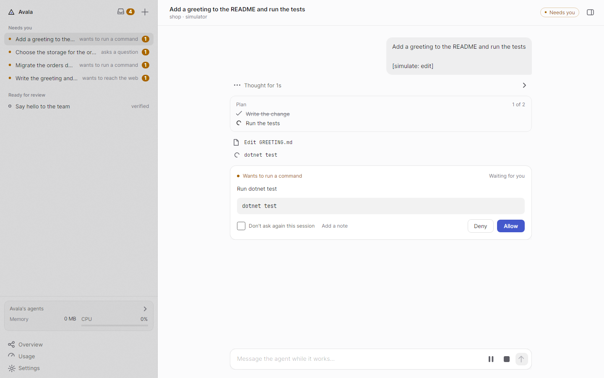
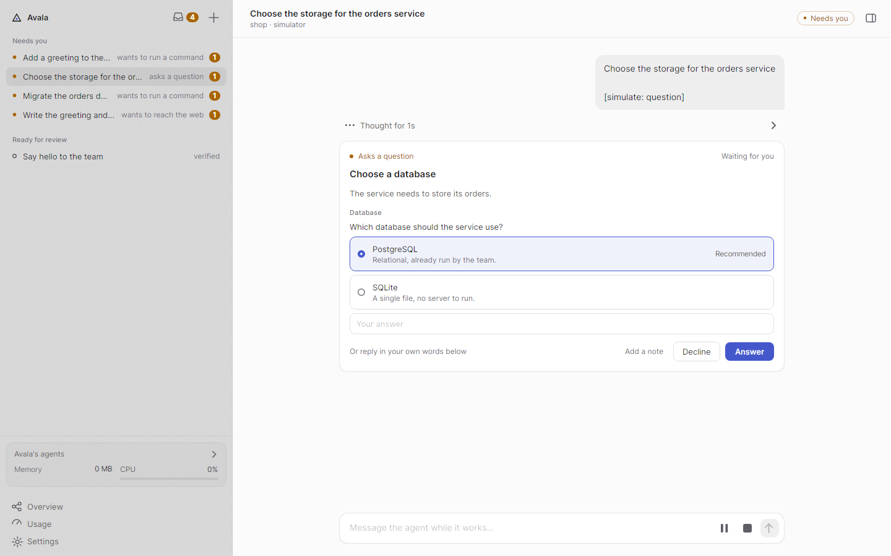

<h1>
  <picture>
    <source media="(prefers-color-scheme: dark)" srcset="docs/assets/brand/avala-lockup-dark.png">
    
  </picture>
</h1>

**Agents you can trust without watching.**

[](docs/architecture.md#technical-debt-grade)
[](docs/architecture.md#quality-metrics)
[](docs/architecture.md#technical-debt-grade)
[](docs/architecture.md#technical-debt-grade)
[](docs/architecture.md#quality-metrics)
[](#a-note-on-t3-code)

Avala is an open-source desktop harness for coding agents. It runs each agent in its own git worktree and lets it work unattended, while every decision is governed by your rules, every result is backed by evidence, and every cost is accounted for.

<picture>
  <source media="(prefers-color-scheme: dark)" srcset="docs/assets/avala-main-dark.png">
  
</picture>

## What it does

- **Evidence, not the agent's word.** A job is done only when your repository's own checks pass in its worktree, and its review shows the verdict first and only what deserves a look.
- **Policies, not prompts.** Every permission and question goes through rules the agent cannot edit, at the autonomy level you choose, and every answer is audited.
- **Nothing runs away.** Stalled or lost sessions are caught, spending stops at your caps, and leftover processes, ports and worktrees are reclaimed.
- **Any agent, any account.** Harnesses plug in behind one contract, with several connections per harness, and sub-agents run as governed jobs of their own.

<picture>
  <source media="(prefers-color-scheme: dark)" srcset="docs/assets/avala-question-dark.png">
  
</picture>

## Status

Beta-ready. Everything below runs in the application today, with Claude Code as the first real harness and a built-in simulator for trying Avala without spending tokens:

- jobs in their own worktrees, verified by your repository's checks and reviewed from a verdict and a diff before they are merged or kept;
- permissions, questions and plan approvals answered in place or by the rules of your repository, at the autonomy you allow;
- supervision of stalled sessions, budgets per job and per connection, and reclaimed processes, ports and worktrees;
- several connections and accounts per harness, delegation to sub-agents and an autopilot for a backlog;
- usage and limits per connection, canvases drawn as Markdown, SVG and Mermaid, a light and a dark theme, and jobs that survive a restart.

Screenshots are taken from the real application, driven headless by the simulator.

## Install

Coming soon: builds for Windows, macOS and Linux will be published on the [releases page](https://github.com/rick-dev-creator/avala/releases). Until then, build it from source.

## Build

Requires the .NET 10 SDK and git 2.40 or later.

```
dotnet build Avala.slnx
dotnet test --solution Avala.slnx
```

## Learn more

- [Architecture](docs/architecture.md): the rules every change must pass.
- [Core design](docs/design/core.md) and [plan](docs/plan/core.md).
- [Releasing](docs/release.md): packages, signing and the update check.
- [AGENTS.md](AGENTS.md): how to contribute, with or without an agent.

## A note on T3 Code

[T3 Code](https://github.com/pingdotgg/t3code) is one of the most popular open-source harnesses for building software with coding agents, so we use it as a fixed reference to measure Avala's size against.

It is only a yardstick. The two projects differ in scope, since T3 Code also ships web and mobile clients and Avala does not, so the numbers describe size, not a like-for-like comparison of features. [How the lines are counted](docs/architecture.md#quality-metrics).

We respect and admire the work of its developers. The comparison is not a criticism of the project or of the people behind it.

## License

[MIT](LICENSE)
