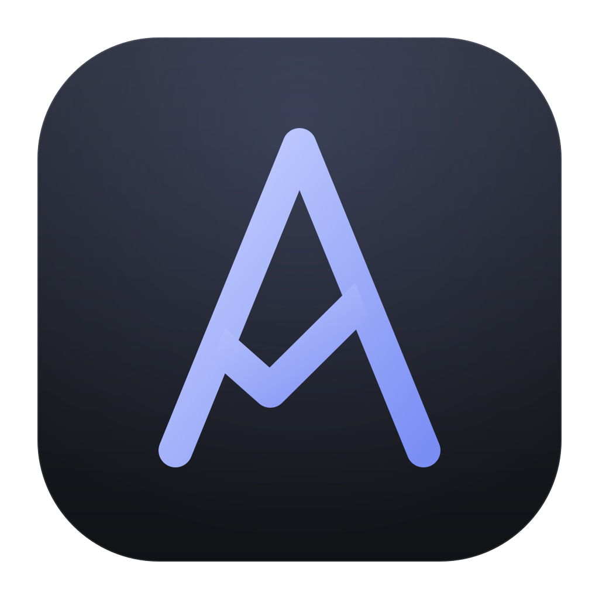

<h1>&nbsp;Avala</h1>

**Agents you can trust without watching.**

Avala is an open-source desktop harness for coding agents. It runs each agent in its own git worktree and lets it work unattended, while every decision is governed by your rules, every result is backed by evidence, and every cost is accounted for.


<sub>The approved design of the main window. The application is being built to it.</sub>

## What it does

- **Evidence, not the agent's word.** A job is done only when your repository's own checks pass in its worktree, and its review shows the verdict first and only what deserves a look.
- **Policies, not prompts.** Every permission and question goes through rules the agent cannot edit, at the autonomy level you choose, and every answer is audited.
- **Nothing runs away.** Stalled or lost sessions are caught, spending stops at your caps, and leftover processes, ports and worktrees are reclaimed.
- **Any agent, any account.** Harnesses plug in behind one contract, with several connections per harness, and sub-agents run as governed jobs of their own.

## Status

Early and built in public. The core, the trust layer and the view models run end to end against a simulated agent; the views and the first real harness, Claude Code, come next.

## Build

Requires the .NET 10 SDK and git 2.40 or later.

```
dotnet build Avala.slnx
dotnet test --solution Avala.slnx
```

## Learn more

- [Architecture](docs/architecture.md): the rules every change must pass.
- [Core design](docs/design/core.md) and [plan](docs/plan/core.md).
- [AGENTS.md](AGENTS.md): how to contribute, with or without an agent.

## License

[MIT](LICENSE)
