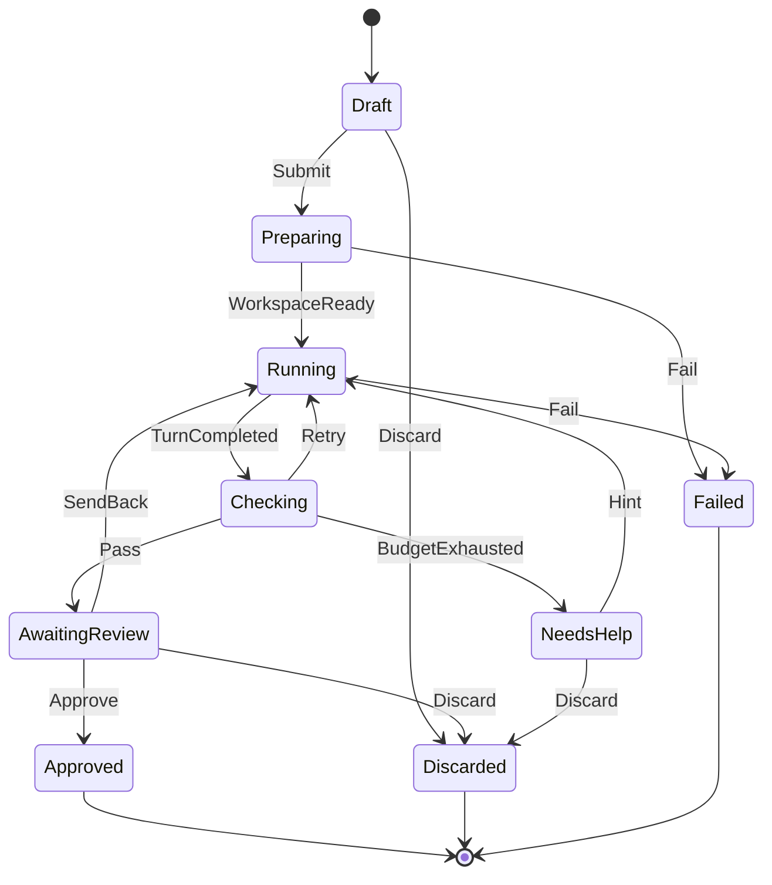

# Core design

Status: draft. Each decision is marked **Accepted** or **Proposed**.

## Goals

- Run any coding agent through one agnostic core. The core never knows which agent or harness it drives.
- Decompose orchestration into small modules with explicit contracts, instead of one orchestrator that owns everything.
- Keep business rules in the domain, deterministic and unit-testable without infrastructure.
- Favor composition over inheritance everywhere.

## Lessons from existing harnesses

T3 Code is the reference point. Its history (5,023 commits, about 907k non-test lines) shows what to avoid:

| Problem in T3 Code | Evidence | Answer in Avala |
| --- | --- | --- |
| One orchestrator mixes execution with UI state such as pin, snooze and unread | `Orchestrator.ts`, 11,031 lines, about 60 commands | Execution, workspaces, UI state and integrations live in separate modules |
| Every provider adapter re-derives lifecycle semantics | Adapters of 4,000 to 8,000 lines; fixes counted per provider | Thin adapters translate protocols; one `TurnLifecycle` in the core enforces the rules |
| The model is built around one provider, others are adapted through optional methods | 102 fixes about runs that never settle | The contract is the common denominator plus declared capabilities |
| Several durable layers: event log, projections, outbox, receipts, cursors | 113 fixes about resume and recovery | Plain state persistence, idempotent handlers, recovery from state |
| A 10,400-line view component | `ChatView.tsx` | One view model and one template per event type |

## Terminology

| Term | Meaning |
| --- | --- |
| Job | A unit of work delegated to an agent. Not `Task`, which collides with `System.Threading.Tasks.Task` in every async signature. **Accepted** |
| Attempt | One run of an agent on a job, from start until the agent ends its turn |
| Session | A live connection to an agent through its provider |
| Turn | One exchange inside a session, from the agent starting to work until it stops |
| Workspace | The isolated working copy of a job: folder, branch, checkpoints |
| Gate | A component that judges a completed attempt before the job moves on |

## Modules

Every module is internal. Only its `Contracts` project is public, and only when another module or a plugin needs it. **Accepted**

| Module | Responsibility | Public contracts |
| --- | --- | --- |
| Jobs | Job lifecycle, attempts, attempt budget, the job flow coordinator | `JobId`, integration events, `IJobs`, `ICompletionGate` |
| Agents | Sessions, turn integrity, provider registry | `IAgentProvider`, `IAgentSession`, `AgentEvent`, `AgentCapabilities` |
| Workspaces | Working copies, branches, checkpoints | `IWorkspaces`, integration events |
| Timeline | Read model of everything that happened in a job, for the activity view | Queries |

Agent providers such as Claude Code or Codex are plugins of their own. They depend only on `Agents.Contracts`. **Accepted**

## Domain model

### No base classes

Classic DDD relies on `Entity`, `AggregateRoot` and `ValueObject` base classes. Avala uses none of them. **Accepted**

- Identifiers and value objects are `readonly record struct`: value equality, immutability, no inheritance.
- Aggregates are `sealed` classes that compose what they need.
- Aggregates do not collect domain events. Every operation returns its event inside a `Result`.

```csharp
public readonly record struct JobId(Guid Value)
{
    public static JobId New() => new(Guid.CreateVersion7());
}

internal sealed class Job
{
    public JobId Id { get; }
    public JobState State { get; private set; }

    public Result<AttemptStarted, JobError> StartAttempt(SessionId session);
    public Result<AttemptCompleted, JobError> CompleteAttempt(GateVerdict verdict);
    public Result<JobApproved, JobError> Approve();
}
```

### State machines

State machines use the [Stateless](https://github.com/dotnet-state-machine/stateless) library. **Accepted**

- The aggregate contains its machine. Nothing inherits from it.
- The machine uses external state storage, so the aggregate's `State` property stays the source of truth and is persisted normally.
- Hierarchical states (`SubstateOf`) and guards (`PermitIf`) model the rules.
- Several small machines are composed instead of one large one. This is the statechart equivalent of orthogonal regions.
- Machines decide transitions only. Their actions perform no I/O. Side effects belong to the application layer.
- The aggregate never calls `Fire` blindly. It asks `CanFire` first, guards included, and returns a typed error when the trigger is not allowed. `Fire` therefore never throws.
- Diagrams in this folder are generated from the machines with Stateless's `MermaidGraph`, and a test fails when a diagram is out of date. **Accepted**

| Machine | Module | States |
| --- | --- | --- |
| `JobLifecycle` | Jobs | Draft, Preparing, Running, Checking, AwaitingReview, NeedsHelp, Approved, Discarded, Failed |
| `AttemptLifecycle` | Jobs | Started, Completed, Passed, Rejected |
| `TurnLifecycle` | Agents | Idle, Working, AwaitingPermission, Completed, Interrupted, Failed |
| `WorkspaceLifecycle` | Workspaces | Creating, Ready, Disposed |



### Result pattern

**Accepted**

- `Result` never throws. There is no `Value` property that throws on failure. Values are read only through `Match` or `TryGetValue`.
- Failures are deterministic, predictable error codes: one `enum` per module. No magic strings.
- `Result` is typed by its module's error enum, so the compiler guarantees that Jobs returns only Jobs errors, and a `switch` over the codes reports missing cases.
- The domain returns codes only. The presentation layer maps codes to text, which keeps the domain free of copy and ready for localization.
- At module boundaries, errors are translated explicitly. An error of one module never leaks into another.
- Exceptions are reserved for bugs and broken infrastructure.
- `Result` lives in the SDK and is written in-house: it is small, and a third-party library would put a dependency at the heart of every module.

```csharp
internal enum JobError
{
    InvalidTransition,
    AttemptBudgetExhausted,
    NotAwaitingReview,
}

var outcome = job.Approve().Match(
    approved => …,
    error => error switch
    {
        JobError.NotAwaitingReview => …,
        JobError.InvalidTransition => …,
        JobError.AttemptBudgetExhausted => …,
    });
```

## Events

### Two kinds of events

**Accepted**

- **Domain events** are internal to a module. The application layer receives them from the aggregate and reacts directly. They need no bus.
- **Integration events** live in a module's `Contracts` and travel through the event bus to other modules and plugins.
- Each module translates domain events into integration events in a single place, which makes the public surface an explicit choice.

### Publishing

1. The application layer loads the aggregate.
2. It calls the operation and receives `Result<TEvent, TError>`.
3. On failure it returns the error. Nothing is stored and nothing is published.
4. On success it stores the new state.
5. It translates the event and publishes it on the bus.

### Event bus

**Accepted**

```csharp
public interface IEventBus
{
    ValueTask PublishAsync<TEvent>(TEvent integrationEvent, CancellationToken cancellationToken)
        where TEvent : IIntegrationEvent;
}

public interface IHandle<in TEvent>
    where TEvent : IIntegrationEvent
{
    ValueTask HandleAsync(TEvent integrationEvent, CancellationToken cancellationToken);
}
```

- Plugins subscribe by composition: they register `IHandle<T>` implementations and the bus discovers them.
- `Avala.Runtime` implements the bus with `System.Threading.Channels`: one asynchronous queue and one dispatcher, which preserves event order and never blocks the publisher.
- A failing handler is isolated and logged. The other handlers still run.
- Unit tests use an in-memory bus that records what was published.

### Event feed for view models

**Accepted**

View models do not implement handlers. They subscribe to a stream while they are active.

```csharp
public interface IEventFeed
{
    IAsyncEnumerable<TEvent> SubscribeAsync<TEvent>(CancellationToken cancellationToken)
        where TEvent : IIntegrationEvent;
}
```

- Activation starts an `await foreach`. Deactivation cancels the token and ends the subscription, so no subscription outlives its screen.
- Events arrive off the UI thread. The SDK defines `IUiDispatcher` and the host implements it, so view models stay unaware of Avalonia.

### Consistency without an outbox

**Accepted**

- Stored state is the truth. Events are notifications.
- On startup the job flow coordinator inspects every job that is not finished and resumes it from its state, so a lost event is recovered.
- Handlers are idempotent: receiving an event twice has the effect of receiving it once.

## Job flow coordinator

The coordinator replaces the orchestrator. It is a stateless table of reactions inside Jobs: the state of the flow is the `Job` aggregate itself. **Accepted**

| When | Then |
| --- | --- |
| `JobSubmitted` | `IWorkspaces.PrepareAsync` |
| `WorkspaceReady` | `job.StartAttempt`, then `IAgentSession.StartAsync` |
| `TurnCompleted` | Evaluate every completion gate, then `job.CompleteAttempt(verdict)` |
| Verdict `Retry` | `IAgentSession.SendAsync(feedback)` |
| Verdict `Pass` | The job moves to `AwaitingReview` |
| Budget exhausted | The job moves to `NeedsHelp` |

### Completion gates

**Proposed**

Plugins join the flow through gates, without touching the core.

```csharp
public interface ICompletionGate
{
    ValueTask<GateVerdict> EvaluateAsync(CompletedAttempt attempt, CancellationToken cancellationToken);
}
```

- With no gate registered, every attempt passes, so the core works on its own.
- Verification registers a gate that runs the checks. Future plugins, such as security policy or a review by a second agent, are further gates.

## Agents

### Contract

**Accepted**

```csharp
public interface IAgentProvider
{
    ProviderInfo Info { get; }
    AgentCapabilities Capabilities { get; }
    ValueTask<Result<IAgentSession, AgentError>> StartAsync(SessionOptions options, CancellationToken cancellationToken);
}

public interface IAgentSession : IAsyncDisposable
{
    IAsyncEnumerable<AgentEvent> Events { get; }
    ValueTask<Result<TurnAccepted, AgentError>> SendAsync(UserTurn turn, CancellationToken cancellationToken);
    ValueTask<Result<PermissionAnswered, AgentError>> RespondAsync(PermissionDecision decision, CancellationToken cancellationToken);
    ValueTask<Result<TurnInterrupted, AgentError>> InterruptAsync(CancellationToken cancellationToken);
}
```

- `SessionOptions` holds harness concepts only: working directory, tools the harness injects through MCP, permission policy. Paths, tokens and protocols belong to each provider's own settings.
- `AgentEvent` is a closed set: turn started and completed, message and reasoning deltas and completions, tool started, updated and completed, permission requested, plan updated, subagent started and completed, usage reported, session failed.
- Behavior depends on `AgentCapabilities`, never on a provider's name. An architecture test forbids provider names outside their plugin. **Proposed**

### Turn integrity

**Accepted**

- `TurnLifecycle` applies every incoming `AgentEvent` and returns a `Result`. It enforces that every started item completes, that nothing arrives after the turn ends, and that an item left open expires and is marked as failed.
- Time comes from `TimeProvider`, so tests advance time without waiting and without blocking.
- These rules are written once for every provider.

### Conformance kit

**Accepted**

Every provider plugin must pass the same test suite, replaying recorded sessions of its provider. A plugin that leaves a turn open or emits events out of order fails before it reaches anyone.

## Persistence

**Accepted**

- EF Core with the SQLite provider: a local database file next to the application, with no server.
- One `DbContext` per module. Each module owns its tables, prefixed with the module name, since SQLite has no schemas. No module reads another module's tables.
- Migrations per module.
- Repositories are internal interfaces of each module's `Application` layer, implemented in `Infrastructure`.
- The domain stays persistence-ignorant: EF Core maps private constructors, private setters and collections backed by private fields. Strongly typed identifiers use value converters.
- EF Core is referenced only from `Infrastructure`, enforced by the layer rules.

### SQLite and blocking

SQLite has no asynchronous I/O. The asynchronous methods of its provider, such as `SaveChangesAsync`, run synchronously, and the banned API analyzer cannot see it because their signatures are asynchronous. Called from the UI thread, they freeze it.

Database work therefore never runs on the UI thread. The mechanism, and an architecture rule that verifies it, are designed with the job flow in phase 5. **Proposed**

## Architecture rules to add

**Accepted**

### Markers and layers

- The SDK defines marker interfaces: `IAggregateRoot`, `IDomainEvent` and `IIntegrationEvent`. They identify building blocks without base classes.
- Every module core is organized in the namespaces `Domain`, `Application`, `Infrastructure` and `ViewModels`.

### Domain encapsulation

1. Aggregates expose no public or internal setters. State changes only through their operations.
2. Aggregates expose no mutable collection, only read-only views such as `IReadOnlyList<T>`.
3. Aggregate constructors are private. Aggregates are created through factory methods that return a `Result`.
4. Every public operation of an aggregate returns a `Result`. No `void` operation changes state.
5. Aggregates reference other aggregates by identifier only, never by object.
6. Every aggregate has an `Id` of a strongly typed identifier: a `readonly record struct` whose name ends in `Id`.

### Domain purity

7. `Domain` depends only on the base class library, the SDK, Stateless and identifiers from other modules' `Contracts`. Never on `Application`, `Infrastructure`, view models, Avalonia or dependency injection.
8. No `Domain` method returns `Task` or `ValueTask`. The domain performs no I/O.
9. `Domain` contains no `throw`. Expected failures travel in a `Result`.
10. Every `Result` in `Domain` uses its own module's error enum, and every module has exactly one.
11. Stateless is used only in `Domain`. `Fire` is never called directly: transitions go through a single helper that checks `CanFire` first, and the banned API analyzer rejects every other call.

### Value objects and events

12. Value objects are `readonly`.
13. Events are immutable: `init` only, never `set`.
14. Domain events live in `Domain`. Integration events live only in `Contracts`.

### Module boundaries

15. Layers inside a module, enforced with ArchUnitNET: `Application` depends on `Domain`, `Infrastructure` implements interfaces of `Application`, view models use `Application` and never `Infrastructure` or `Domain` directly.
16. `InternalsVisibleTo` targets only the module's own projects and its test project.
17. `Contracts` hold no logic: only interfaces, records, enums and structs.
18. No plugin references the host.
19. No provider name appears outside its own plugin. Added with the first provider, since it has nothing to check before.
20. Every module exposes exactly one plugin entry, in its core or its UI, so modules without UI, such as providers, fit.

### Rules that cannot pass vacuously

Every rule is tested against a fixtures assembly inside the architecture tests that violates it on purpose. If a rule stops detecting its fixture, its test fails. A rule therefore keeps working even while no production code exercises it.
