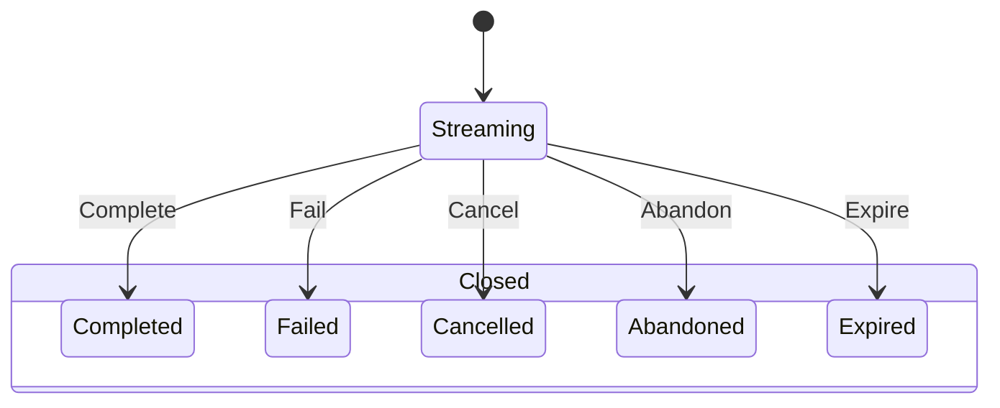

# Canvas lifecycle

Generated from `CanvasLifecycle`. Run the tests with `AVALA_UPDATE_DIAGRAMS=1` to refresh it.

```mermaid
stateDiagram-v2
	state Closed {
		Completed
		Failed
		Cancelled
		Abandoned
		Expired
	}
	Streaming --> Completed : Complete
	Streaming --> Failed : Fail
	Streaming --> Cancelled : Cancel
	Streaming --> Abandoned : Abandon
	Streaming --> Expired : Expire
[*] --> Streaming
```
