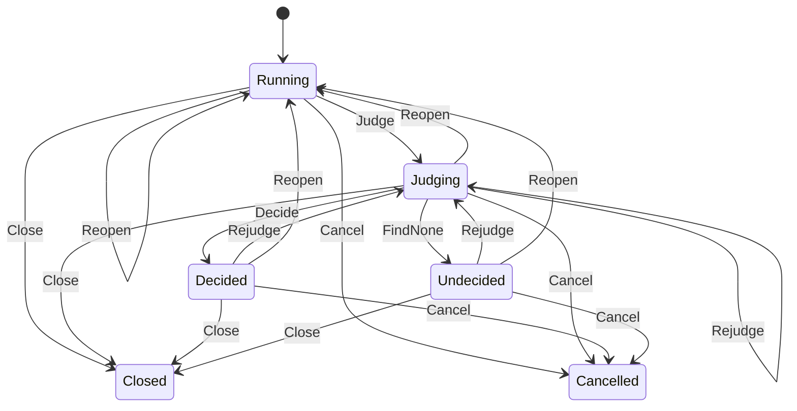

# Contest lifecycle

Generated from `ContestLifecycle`. Run the tests with `AVALA_UPDATE_DIAGRAMS=1` to refresh it.

```mermaid
stateDiagram-v2
	Running --> Judging : Judge
	Running --> Running : Reopen
	Running --> Closed : Close
	Running --> Cancelled : Cancel
	Judging --> Decided : Decide
	Judging --> Undecided : FindNone
	Judging --> Judging : Rejudge
	Judging --> Running : Reopen
	Judging --> Closed : Close
	Judging --> Cancelled : Cancel
	Decided --> Judging : Rejudge
	Decided --> Running : Reopen
	Decided --> Closed : Close
	Decided --> Cancelled : Cancel
	Undecided --> Judging : Rejudge
	Undecided --> Running : Reopen
	Undecided --> Closed : Close
	Undecided --> Cancelled : Cancel
[*] --> Running
```
