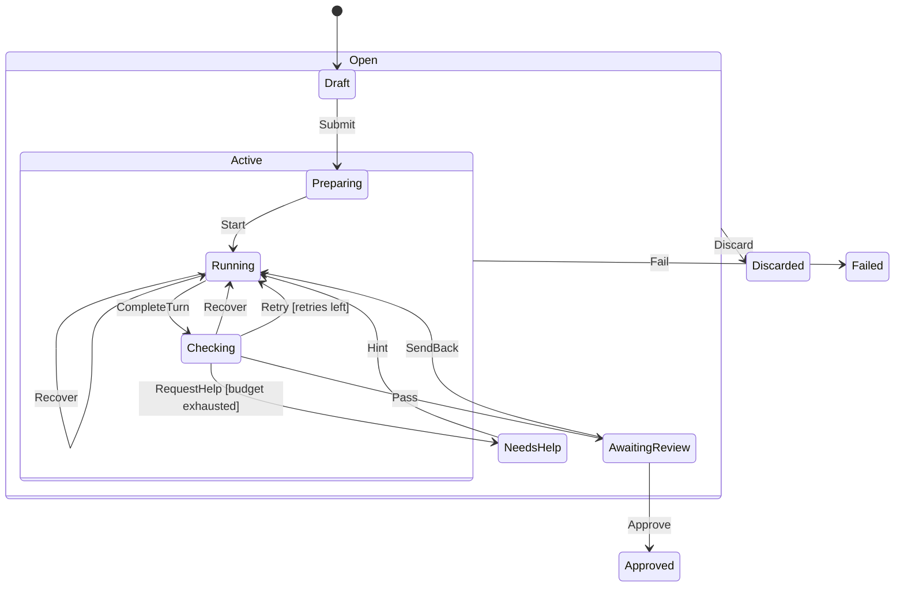

# Job lifecycle

Generated from `JobLifecycle`. Run the tests with `AVALA_UPDATE_DIAGRAMS=1` to refresh it.

```mermaid
stateDiagram-v2
	state Open {
		Active
		Draft
		NeedsHelp
		AwaitingReview
	}
	state Active {
		Preparing
		Running
		Checking
	}
	Open --> Discarded : Discard
	Active --> Failed : Fail
	Draft --> Preparing : Submit
	Preparing --> Running : Start
	Running --> Checking : CompleteTurn
	Running --> Running : Recover
	Checking --> Running : Recover
	Checking --> AwaitingReview : Pass
	Checking --> Running : Retry [retries left]
	Checking --> NeedsHelp : RequestHelp [budget exhausted]
	NeedsHelp --> Running : Hint
	AwaitingReview --> Running : SendBack
	AwaitingReview --> Approved : Approve
[*] --> Draft
```
