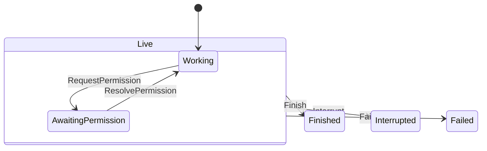

# Turn lifecycle

Generated from `TurnLifecycle`. Run the tests with `AVALA_UPDATE_DIAGRAMS=1` to refresh it.

```mermaid
stateDiagram-v2
	state Live {
		Working
		AwaitingPermission
	}
	Live --> Finished : Finish
	Live --> Interrupted : Interrupt
	Live --> Failed : Fail
	Working --> AwaitingPermission : RequestPermission
	AwaitingPermission --> Working : ResolvePermission
[*] --> Working
```
