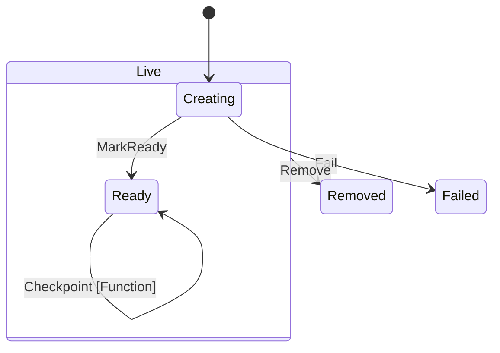

# Workspace lifecycle

Generated from `WorkspaceLifecycle`. Run the tests with `AVALA_UPDATE_DIAGRAMS=1` to refresh it.

```mermaid
stateDiagram-v2
	state Live {
		Creating
		Ready
	}
	Live --> Removed : Remove
	Creating --> Ready : MarkReady
	Creating --> Failed : Fail
	Ready --> Ready : Checkpoint [Function]
[*] --> Creating
```
